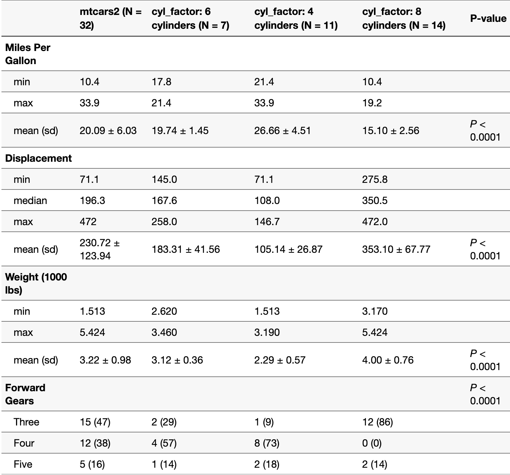
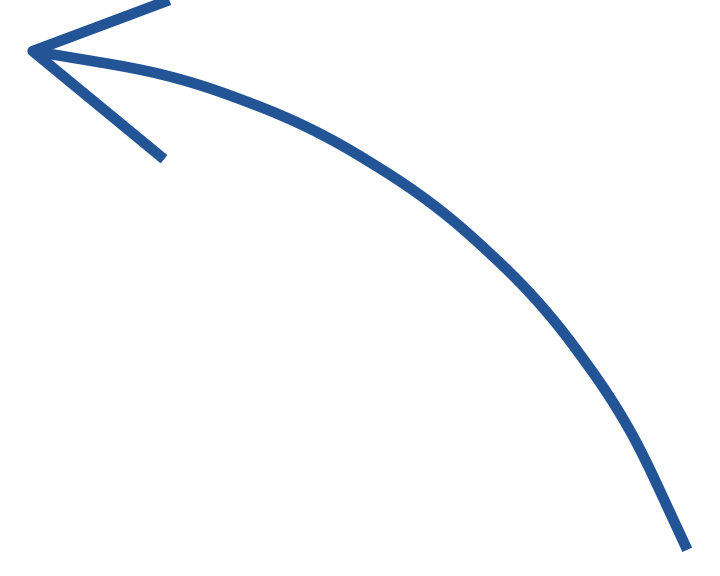
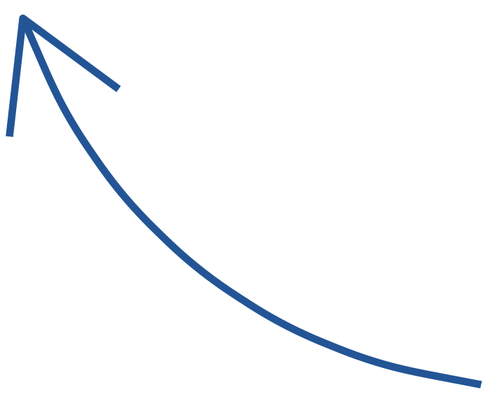

# Admitting you Have a Problem

.pull-left[
.big[If you explore your data only with **tables**, we will pour cappuccino on your laptop...]
]

.pull-right[

]

.hand[.note2[THIS TABLE IS ACTUALLY FROM A [VERY HELPFUL R PACKAGE](https://cran.r-project.org/web/packages/qwraps2/vignettes/summary-statistics.html)]]

---

# Boxplot

---

# Scatterplots and Trends

---

# 98.3% of Viz Die Before Reaching Social Media!

.hand[.note1[HE JUST MADE THAT UP]]

---

# 
